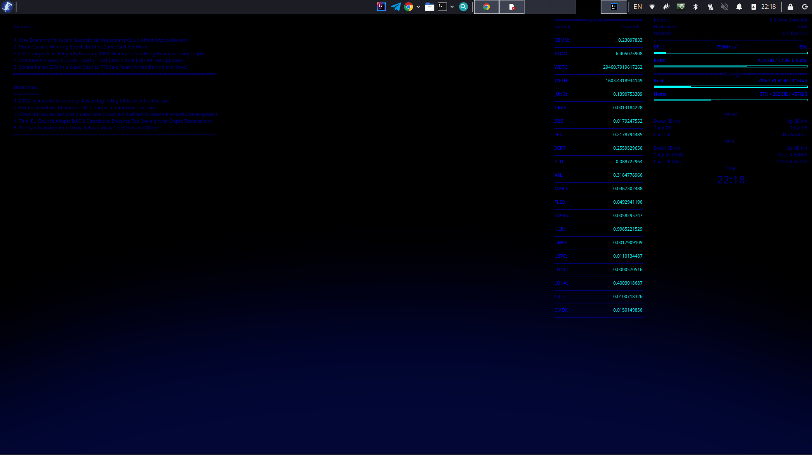

# conky-crypto

Desktop widgets for Linux using [Conky](https://github.com/brndnmtthws/conky): system stats, Osmosis token prices, and crypto news RSS feeds.

## Widgets

| Widget | File | Description |
|--------|------|-------------|
| System | `conky-general` | CPU, RAM, disks, network, clock |
| Osmosis | `conky-osmosis` | Token USD prices from Numia public API |
| News | `conky-rss` | Headlines from CoinDesk and Blockchain.news |

Osmosis prices use a single cached request to:

`https://public-osmosis-api.numia.xyz/tokens/v2/all`

Symbols are listed in `config/tokens.list` (one per line). When several entries share a symbol, the price with the highest liquidity is shown.

## Requirements

- Conky (Lua/API version used by your distro package)
- `curl`, `jq`, `bash`
- X11 or compatible desktop session

```bash
# Debian/Ubuntu
sudo apt install conky-all curl jq
```

## Quick start

```bash
git clone https://github.com/mykola-riabov/conky-crypto.git
cd conky-crypto
chmod +x conky/conky-start.sh scripts/osmosis-price.sh
./conky/conky-start.sh
```

`conky-start.sh` writes generated configs to `~/.config/conky-crypto/generated/` with absolute paths to this repo.

Edit `config/tokens.list` to change which Osmosis symbols are displayed, then run `conky-start.sh` again.

## Osmosis price script

```bash
./scripts/osmosis-price.sh OSMO
./scripts/osmosis-price.sh ATOM
```

Environment variables:

| Variable | Default |
|----------|---------|
| `OSMOSIS_API_URL` | `https://public-osmosis-api.numia.xyz/tokens/v2/all` |
| `OSMOSIS_CACHE_MAX_AGE` | `60` (seconds) |

Cache file: `~/.cache/conky-crypto/osmosis-tokens.json`

## Systemd (user service)

```bash
./systemd/install-user-unit.sh
# edit ~/.config/conky-crypto/env if needed
systemctl --user enable --now conky-crypto.service
```

Optional timer (start 30s after boot):

```bash
systemctl --user enable --now conky-crypto.timer
```

Logs: `journalctl --user -u conky-crypto.service -f`

## Project layout

```
.
├── config/
│   └── tokens.list          # symbols for Osmosis widget
├── conky/
│   ├── conky-start.sh
│   └── config/
│       ├── conky-general.in
│       ├── conky-osmosis.in
│       └── conky-rss.in
├── scripts/
│   └── osmosis-price.sh
├── source/
│   └── conky-crypto.png
└── systemd/
    ├── conky-crypto.env.example
    ├── install-user-unit.sh
    └── user/
        ├── conky-crypto.service
        └── conky-crypto.timer
```

## Notes

- Generated configs are not committed; they live under `~/.config/conky-crypto/generated/`.
- Network interface names (`eth0`, `wlan0`) may differ on your machine; adjust `conky-general.in` if needed.
- RSS widgets refresh every 5 minutes (`update_interval` in `conky-rss.in`).
- Tokens without a price in the API are shown as `n/a`.

## Screenshot


